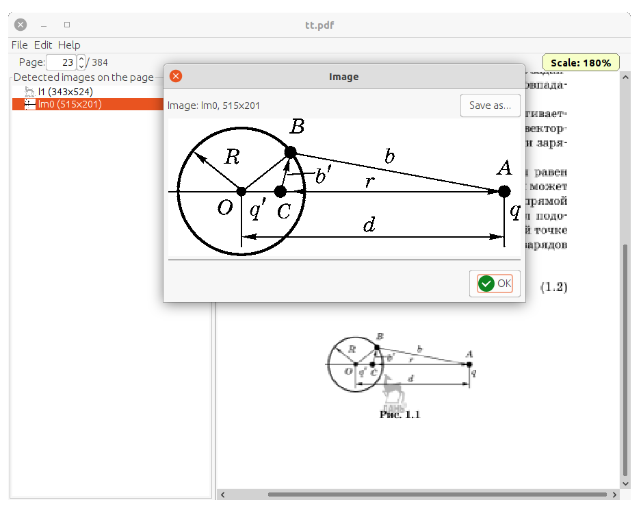

   
[](http://www.apache.org/licenses/LICENSE-2.0)
[](https://bell-sw.com/pages/downloads/#/java-11-lts)   
[](https://www.arthursacresanimalsanctuary.org/donate)

# PDF Image Tool

Small GUI utility for manipulating images and pages in PDF documents.

## Features

- **Hide images**  
  Hide selected images on a single page or across the entire document.  
  Images can be identified by **name** or by **image data**.

- **Extract images**  
  Save any selected image from the PDF as a separate image file.

- **Replace images**  
  Replace selected images with an image loaded from a file.  
  Can be applied to a single page or all pages.  
  Matching can be done by **image name** (fast) or **image data** (slower).

- **Page operations**
    - **Reorder pages**
    - **Remove pages**

Useful for removing unwanted graphics, replacing logos, extracting embedded images, or reorganizing pages in PDF files.

   

# How to start?

The utility is written in pure Java and requires pre-installed JDK 9+ for its work. If Java is not installed on your system, you can download it from [the page](https://bell-sw.com/pages/downloads/#jdk-21-lts).

You can download starter for your OS but also you can download just pure JAR archive.

Pre-built starters for different OS:
 - [for Windows](https://github.com/raydac/pdf-image-remover/releases/download/1.1.1/pdf-image-remover-1.1.1.exe)
 - [for Linux/Unix](https://github.com/raydac/pdf-image-remover/releases/download/1.1.1/pdf-image-remover-1.1.1.sh)
 - [for MacOS](https://github.com/raydac/pdf-image-remover/releases/download/1.1.1/pdf-image-remover_1.1.1.dmg)
 - [pure Java](https://github.com/raydac/pdf-image-remover/releases/download/1.1.1/pdf-image-remover-1.1.1.jar)

If you want start the application manually with JDK then use JAR file and start it through command line:
```
java -jar pdf-image-remover-1.1.1.jar
```

# How to use?

Just load a PDF file and navigate through its pages, you can use either the page index spinner or keys PageUp/PageDown/Home/End. The left Tree panel shows found images for the current page and you can see them through double mouse click on tree items. You can zoom shown PDF page with CTRL+mouse wheel. Edit menu provides operations over selected image items.

Don't forget save result of your work as new PDF file.