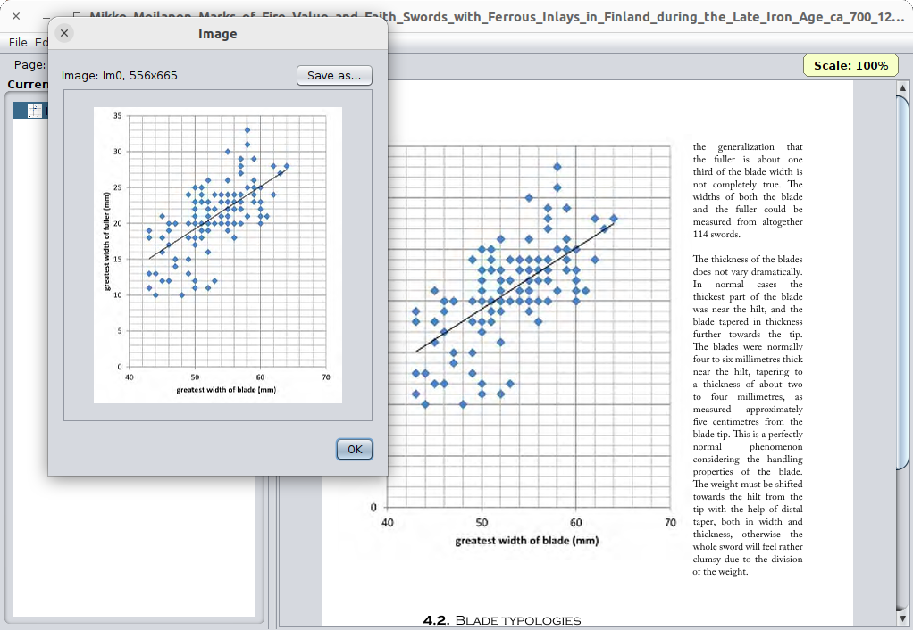

[](http://www.apache.org/licenses/LICENSE-2.0)
[](https://bell-sw.com/pages/downloads/#/java-11-lts)
[](https://www.paypal.com/cgi-bin/webscr?cmd=_s-xclick&hosted_button_id=AHWJHJFBAWGL2)
[](https://yoomoney.ru/to/41001158080699)


# What is it?

Small GUI utility, it allows manipulate images in PDF documents:
 - hide selected ones (for one page or for all pages) by its name or its image data
 - extract selected image from document and save it as image file
 - replace selected images by image loaded from file (for one page or for all pages) by its image name or its image data

   

# How to start?

The utility is written in pure Java and requires pre-installed JDK 9+ for its work. If you have not JDK on your machine, you can download it from [the page](https://libericajdk.ru/pages/downloads/#/java-11-lts).

You can download starter for your OS but also you can download juat pure JAR archive.

Pre-built starters for different OS:
 - [for Windows](https://github.com/raydac/pdf-image-remover/releases/download/1.1.0/pdf-image-remover-1.1.0.exe)
 - [for Linux/Unix](https://github.com/raydac/pdf-image-remover/releases/download/1.1.0/pdf-image-remover-1.1.0.sh)
 - [for MacOS](https://github.com/raydac/pdf-image-remover/releases/download/1.1.0/pdf-image-remover_1.1.0.dmg)
 - [pure Java](https://github.com/raydac/pdf-image-remover/releases/download/1.1.0/pdf-image-remover-1.1.0.jar)

If you want start the application manually with JDK then use JAR file and start it through command line:
```
java -jar pdf-image-remover-1.1.0.jar
```

# How to use?

Just load a PDF file and navigate through its pages, you can use either the page index spinner or keys PageUp/PageDown/Home/End. The left Tree panel shows found images for the current page and you can see them through double mouse click on tree items. You can zoom shown PDF page with CTRL+mouse wheel. Edit menu provides operations over selected image items.

Don't forget save result of your work as new PDF file.